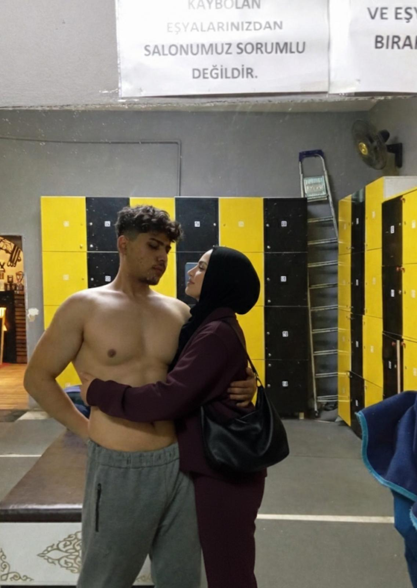
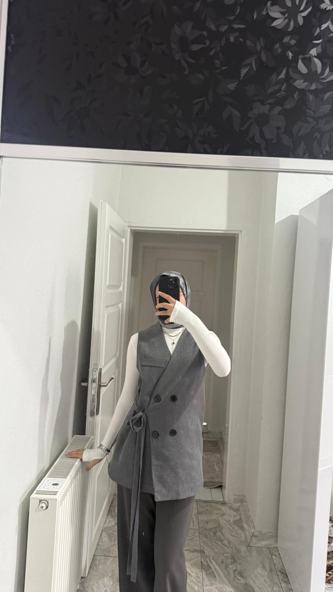
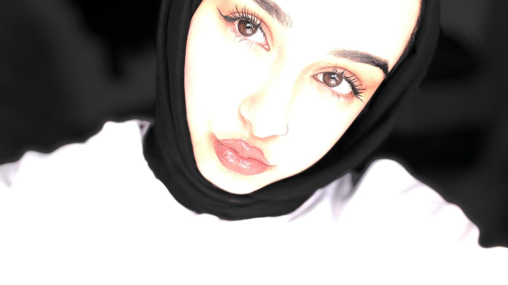
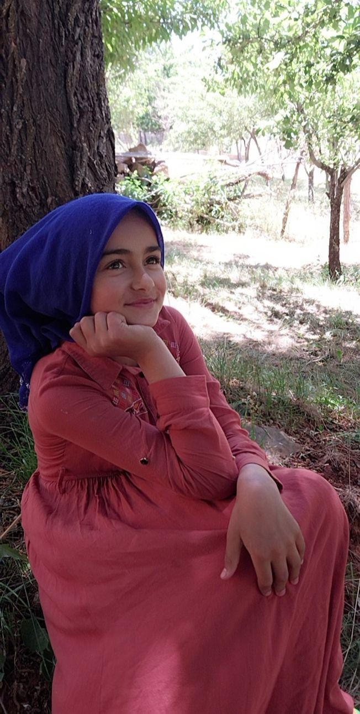
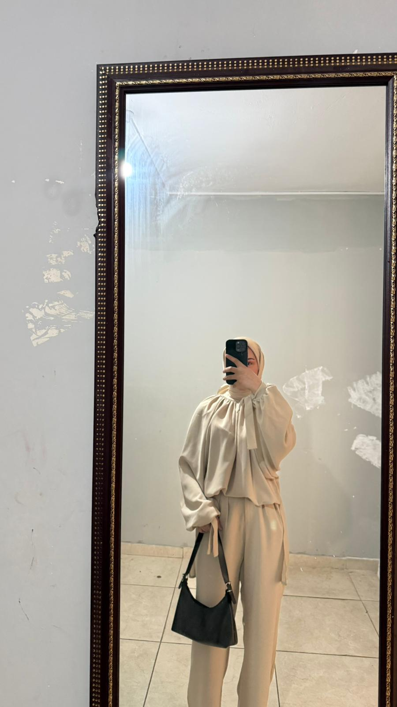

<html lang="tr">
<head>
    <meta charset="UTF-8">
    <meta name="viewport" content="width=device-width, initial-scale=1.0">
    <title>Zeynep 🤍 Feridun</title>
    
</head>
<body>

    <!-- Şifre Ekranı -->
    

        

            
ZEYNEP

            
🤍

            
FERIDUN

        

        <input type="password" id="passwordInput" placeholder="Şifreyi girin...">
        <button id="submitBtn">Giriş Yap ❤️</button>
        
Yanlış şifre, tekrar dene.

    

    <!-- Ana İçerik -->
    

        

        

            <iframe src="https://www.youtube.com/embed/HQxmGjTV5TI?autoplay=1&loop=1&playlist=HQxmGjTV5TI" 
                    frameborder="0" allowfullscreen></iframe>
        

        

            Sen geldin diye hayatım yeniden başladı. 
            Kalbimi çıkardım, yerine seninkini koydum. 
            Sen benim en güzel mucizemsin ❤️
        

        <!-- Fotoğraflar -->
        

            
            
Seninle her bakışım, kalbimin en güzel şiirini yazıyor.

        

        

               <!-- Yeni eklediğin siyah-beyaz fotoğraf -->
            
Gözlerinle kalbime dokunduğun her an, dünyam daha güzel oluyor. Seni sevmek en masum mutluluğum.

        

        

            
            
Yüzüne baktığımda zaman duruyor. Sen benim en derin sessizliğim ve en güzel fırtınamsın.

        

        

            
            
Gözlerin benim için en güzel yıldızlar. Seninle her an kendimi daha çok buluyorum.

        

        

            
            
Senin yanında olmak dünyanın en güvenli yeri. Kalbim sadece seninle atıyor.

        

        

            
            
Seni sevmek, her gün yeni bir bahar açmak gibi. Kalbimi sana adadım.

        

        

            
            
Sonsuza kadar seninle... Sen benim her şeyimsin. Zeynep 🤍 Feridun

        

        <audio id="bgMusic" loop autoplay>
            <source src="music.mp3" type="audio/mpeg">
        </audio>
    

    
</body>
</html>
